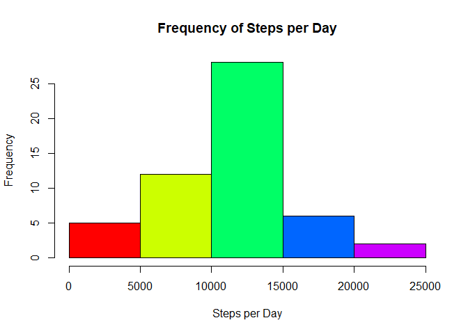
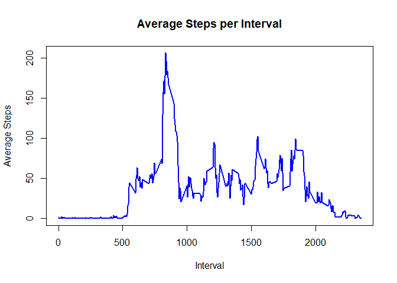
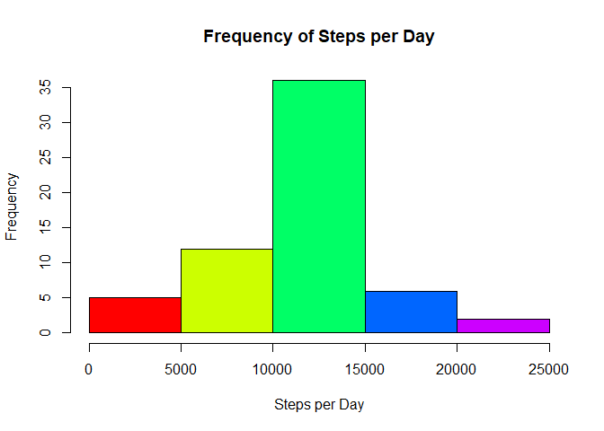
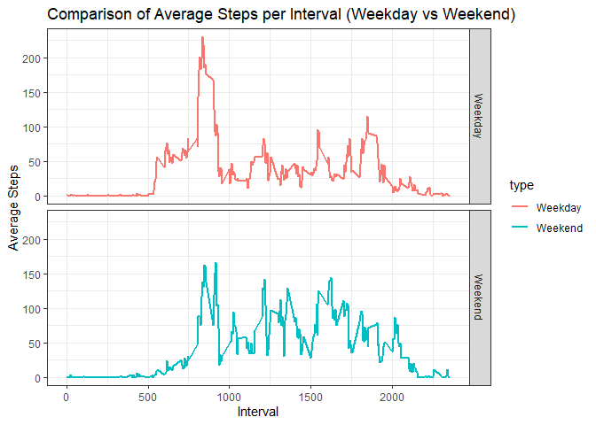

## Loading and preprocessing the data

**Assumption:**
*We are in the working directory and the zip file is already there.*

Unzip the file, read it and store it into a variable:

```r
if(!file.exists("activity.csv")) {
  unzip("activity.zip")
}
activity <- read.csv("activity.csv")
```

Inspect the data set:

```r
head(activity)
```

```
##   steps       date interval
## 1    NA 2012-10-01        0
## 2    NA 2012-10-01        5
## 3    NA 2012-10-01       10
## 4    NA 2012-10-01       15
## 5    NA 2012-10-01       20
## 6    NA 2012-10-01       25
```


## What is mean total number of steps taken per day?

**Assumption:**
*We are not taking into account any missing values (NA).*

Create a histogram of the number of steps per day:

```r
totalStepsPerDay <- tapply(activity$steps, activity$date, sum)
hist(totalStepsPerDay, xlab = "Steps per Day", main = "Frequency of Steps per Day", col = rainbow(5))
```

<!-- -->

Find *mean* and *median* for steps per day:

```r
summaryTotalStepsPerDay <- summary(totalStepsPerDay)
meanStepsPerDay <- as.character(summaryTotalStepsPerDay[[4]])
medianStepsPerDay <- as.character(summaryTotalStepsPerDay[[3]])
```
*Mean:* **10766.1886792453**

*Median:* **10765**


## What is the average daily activity pattern?

**Assumption:**
*We are not taking into account any missing values (NA).*

Create a time series plot for average (across all days) steps on all 5-minute intervals:

```r
avgStepsPerInterval <- tapply(activity$steps, activity$interval, mean, na.rm = TRUE)
avgStepsPerInterval <- data.frame(interval=names(avgStepsPerInterval), averageSteps = avgStepsPerInterval)
avgStepsPerInterval$interval <- as.numeric(as.character(avgStepsPerInterval$interval))
plot(x = avgStepsPerInterval$interval, y = avgStepsPerInterval$averageSteps, type = "l", xlab  = "Interval", ylab = "Average Steps", main = "Average Steps per Interval", col = "blue", lwd = 2)
```

<!-- -->

The 5-minute interval that on average contains the maximum number of steps is the **835** interval. During this intervnal, **206.1698113** steps are walked on average.


## Imputing missing values

Examine how many NA values exist in each of the data set columns:

```r
library(knitr)
library(kableExtra)
NATable <- sapply(as.data.frame(sapply(activity, is.na)), sum)
NATable <- data.frame(Columns=names(NATable), "No of NAs" = NATable)
NATable$Percentage <- paste0(substr(as.character(NATable$No.of.NAs/dim(activity)[1]*100),1,4),"%")
rownames(NATable) <- NULL
kable(NATable) %>% kable_styling(bootstrap_options = "striped", full_width = F, position = "left")
```

<table class="table table-striped" style="width: auto !important; ">
 <thead>
  <tr>
   <th style="text-align:left;"> Columns </th>
   <th style="text-align:right;"> No.of.NAs </th>
   <th style="text-align:left;"> Percentage </th>
  </tr>
 </thead>
<tbody>
  <tr>
   <td style="text-align:left;"> steps </td>
   <td style="text-align:right;"> 2304 </td>
   <td style="text-align:left;"> 13.1% </td>
  </tr>
  <tr>
   <td style="text-align:left;"> date </td>
   <td style="text-align:right;"> 0 </td>
   <td style="text-align:left;"> 0% </td>
  </tr>
  <tr>
   <td style="text-align:left;"> interval </td>
   <td style="text-align:right;"> 0 </td>
   <td style="text-align:left;"> 0% </td>
  </tr>
</tbody>
</table>

Impute missing values in "steps", by using the mean of steps of each respective value in "interval":

```r
intervalMeans <- tapply(activity$steps, activity$interval, mean, na.rm = T)
for (i in 1:length(activity$steps)) {
  if(is.na(activity$steps)[i]) {
    activity$steps[i] <- intervalMeans[names(intervalMeans)==activity$interval[i]]
  }
}
```

Confirm that there are no NAs in the data set:

```r
NATable <- sapply(as.data.frame(sapply(activity, is.na)), sum)
NATable <- data.frame(Columns=names(NATable), "No of NAs" = NATable)
NATable$Percentage <- paste0(substr(as.character(NATable$No.of.NAs/dim(activity)[1]*100),1,4),"%")
rownames(NATable) <- NULL
kable(NATable) %>% kable_styling(bootstrap_options = "striped", full_width = F, position = "left")
```

<table class="table table-striped" style="width: auto !important; ">
 <thead>
  <tr>
   <th style="text-align:left;"> Columns </th>
   <th style="text-align:right;"> No.of.NAs </th>
   <th style="text-align:left;"> Percentage </th>
  </tr>
 </thead>
<tbody>
  <tr>
   <td style="text-align:left;"> steps </td>
   <td style="text-align:right;"> 0 </td>
   <td style="text-align:left;"> 0% </td>
  </tr>
  <tr>
   <td style="text-align:left;"> date </td>
   <td style="text-align:right;"> 0 </td>
   <td style="text-align:left;"> 0% </td>
  </tr>
  <tr>
   <td style="text-align:left;"> interval </td>
   <td style="text-align:right;"> 0 </td>
   <td style="text-align:left;"> 0% </td>
  </tr>
</tbody>
</table>

Create a histogram of the number of steps per day on the imputed data set:

```r
totalStepsPerDay2 <- tapply(activity$steps, activity$date, sum)
hist(totalStepsPerDay2, xlab = "Steps per Day", main = "Frequency of Steps per Day", col = rainbow(5))
```

<!-- -->

Find *mean* and *median* for steps per day on the imputed data set:

```r
summaryTotalStepsPerDay2 <- summary(totalStepsPerDay2)
meanStepsPerDay2 <- as.character(summaryTotalStepsPerDay2[[4]])
medianStepsPerDay2 <- as.character(summaryTotalStepsPerDay2[[3]])
```
*Mean:* **10766.1886792453** (value without imputation: *10766.1886792453*)

*Median:* **10766.1886792453** (value without imputation: *10765*)

##### **Conclusion:** The impact of the imputation is minimal on *mean* and *median*.


## Are there differences in activity patterns between weekdays and weekends?

Add a column that distinguishes weekdays (Mon, Tue, Wed, Thu, Fri) from weekends (Sat, Sun):

```r
library(chron)
activity$type[is.weekend(activity$date)] <- "Weekend"
activity$type[!is.weekend(activity$date)] <- "Weekday"
```

Inspect the new data set:

```r
head(activity)
```

```
##       steps       date interval    type
## 1 1.7169811 2012-10-01        0 Weekday
## 2 0.3396226 2012-10-01        5 Weekday
## 3 0.1320755 2012-10-01       10 Weekday
## 4 0.1509434 2012-10-01       15 Weekday
## 5 0.0754717 2012-10-01       20 Weekday
## 6 2.0943396 2012-10-01       25 Weekday
```

Create a time series plot for average (across all days) steps on all 5-minute intervals, for Weekdays and Weekends:

```r
library(ggplot2)
avgStepsPerIntervalPerType <- aggregate(steps ~ interval+type , activity, mean)
ggplot(avgStepsPerIntervalPerType, aes(x = interval, y = steps, color = type)) + geom_line(lwd = 1) + facet_grid(type~.) + theme_bw() + labs(title = "Comparison of Average Steps per Interval (Weekday vs Weekend)") + xlab("Interval") + ylab("Average Steps")
```

<!-- -->

##### **Conclusion:** There is a peak in steps walked around 8:30 in weekdays, while the steps are more evenly spread out in weekends. The individual starts the daily activity roughly the same time (5:00) both in weekdays and weekends, but gets immediately busy during the weekdays, while in the weekends that happens much more gradually.
